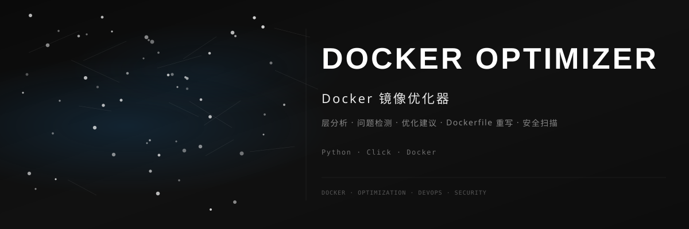

<div align="center">



<br>

### ⚡ Docker 镜像优化器

[](https://github.com/dirjaker/docker_optimizer/stargazers)
[](https://github.com/dirjaker/docker_optimizer/network/members)
[](https://github.com/dirjaker/docker_optimizer/graphs/contributors)
[](https://github.com/dirjaker/docker_optimizer/blob/dev/LICENSE)

</div>

---

## ✨ 功能特性

| 功能 | 描述 |
|------|------|
| 🔍 **层分析** | 逐层解析镜像构建过程，定位体积瓶颈 |
| ⚠️ **问题检测** | 自动检测常见 Dockerfile 问题和反模式 |
| 💡 **优化建议** | 生成针对性的优化建议和改进方案 |
| 📝 **Dockerfile 重写** | 自动优化 Dockerfile，应用最佳实践 |
| 🔒 **安全扫描** | 检测镜像中的已知漏洞和安全风险 |
| 📊 **体积对比** | 优化前后的镜像体积对比报告 |


## 🚀 快速开始

```bash
# 克隆项目
git clone https://github.com/dirjaker/docker_optimizer.git
cd docker_optimizer

# 创建虚拟环境
conda create -n docker_optimizer python=3.12 -y
conda activate docker_optimizer

# 安装依赖
pip install -r requirements.txt

# 运行项目
python main.py
```

## 🛠️ 技术栈

| 层级 | 技术 |
|------|------|
| **CLI** | Click, Rich |
| **解析** | Python, JSON |
| **Docker** | Docker Engine API |
| **输出** | Terminal, HTML |

## 📝 开发日志

- [x] 镜像层分析器
- [x] 问题检测引擎
- [x] 优化建议生成
- [x] Dockerfile 重写
- [x] CLI 工具
- [ ] Web 界面
- [ ] CI/CD 集成
- [ ] 多镜像批量分析

## 📄 许可证

[MIT License](LICENSE)

---

<div align="center">

🔗 **GitHub**: [dirjaker/docker_optimizer](https://github.com/dirjaker/docker_optimizer)

⭐ 如果这个项目对你有帮助，请给一个 Star 支持一下！

</div>
